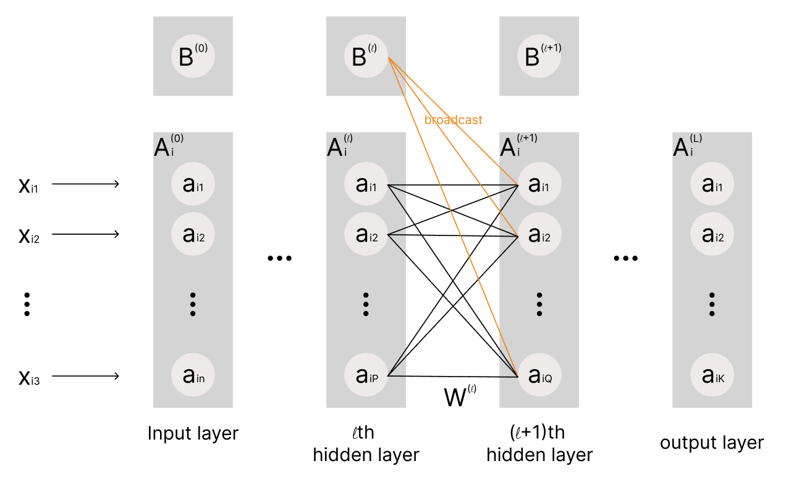
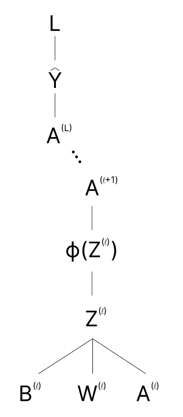
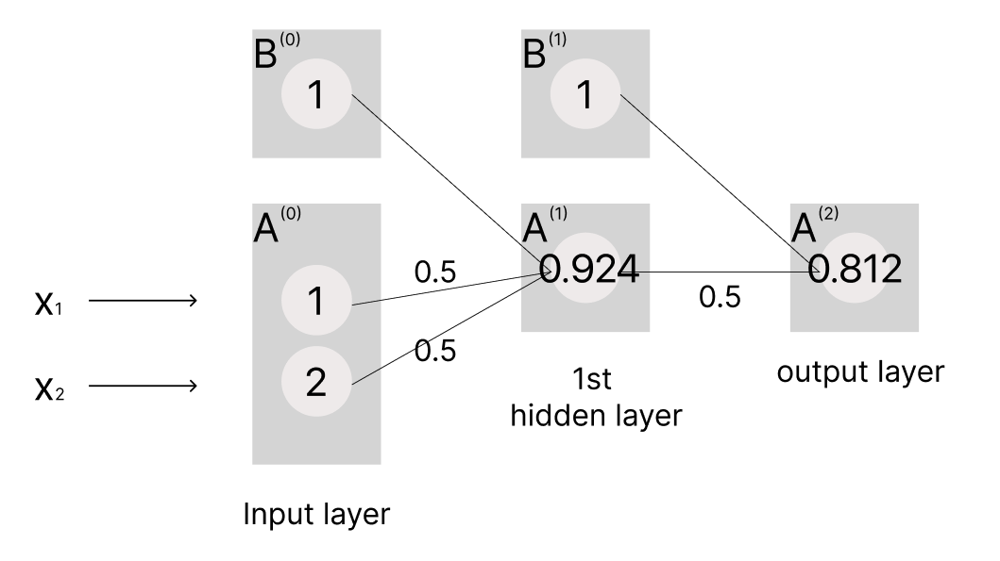

# Forward-and-Backward-Propagation-in-MLP
-- Yuanshan Zhang

I here provide a theoretical explanation for forward and backward propagation in MLP. Then, I will use theoretical formulas to calculate the gradients and compare them to the calculation using PyTorch

## MLP Structure
A typical MLP is structured as follows:

MLP consists of: 1. layers(an input layer, hidden layers, and an output layer) 2. activation neurons 3. bias units 4. weights. 

We can observe that activation neurons of two neighbor layers are connected by weights, and biases of the current layer are broadcasted to the activation neurons on the next layer. 

Definitions:
- $A^{(0)}$ is the activation matrix with the number of neurons equal to the number of input features for each sample on the input layer
- $A^{(L)}$ is the activation matrix with the number of neurons equal to the number of output features for each sample on the output layer
- $A^{(l)}$ is the activation matrix with $P$ neurons for each sample on the $l$ th hidden layer
- $A^{(l+1)}$ is the activation matrix with $Q$ neurons for each sample on the $(l+1)$ th hidden layer
- $W^{(l)}$ is the weight matrix connecting the activation neurons on the $l$ th hidden layer to the activation neurons $(l+1)$ th hidden layer
- $B^{(l)}$ is the bias matrix on the $l$ th layer, and is initialized to 1
- b_q^{(l)} is the bias on the l th layer and broadcasted to the q th neuron on the (l+1) th layer
- $\phi(Z^{(l)})$ is the activation function that calculates $A^{(l+1)}$
- $Z^{(l)}$ is the net input function that combines $A^{(l)}$ and $W^{(l)}$
- $m$ is the batch size
- $p$ is the index for a neuron on the $l$ th layer
- $q$ is the index for a neuron on the $(l+1)$ th layer

## Forward Propagation
Forward propagation updates the values of activation neurons.

For the $i$ th sample, activate neurons on the $l$ th hidden layer are: $A_i^{(l)}=\left[a_{i1} \ a_{i2} \ldots a_{iP} \right]$

The weight vector connecting to the $q$ th neuron on the $(l+1)$ th hidden layer from the lth hidden layer is:

$$
W_{j=q}^{(l)}=\left[\begin{array}{c}
w_{1 q} \\
w_{2 q} \\
\vdots \\
w_{P q}
\end{array}\right]
$$

The net input function from the $l$ th layer to the $(l+1)$ th layer is: $z_{iq}^{(l)}=(b_q+a_{i 1} w_{1 q}+\cdots+a_{i P} w_{P q})^{(l)}=b_q^{(l)} +A_i^{(l)} W_{j=q}^{(l)}$

- Rewrite in the form of matrix: $Z^{(l)}=\underset{Q \times 1}{B^{(l)}}+ \underset{m \times Q}{A^{(l)}W^{(l)}}$, $B^{(l)}$ is broadcasted to $A^{(l)}W^{(l)}$

The $q$ th activate neuron on the $(l+1)$ th hidden layer is: $a_{i q}^{(l+1)}=\phi(z_{iq}^{(l)})$. 
- Rewrite in the form of matrix: $A^{(l+1)} = \phi(Z^{(l)})$

Matrix Expressions:

$$
\begin{aligned} A^{(l)}=\underset{m \times P}{\left[\begin{array}
{cccc}a_{11} & a_{12} & \cdots & a_{1 P} \\ 
a_{21} & a_{22} & \ldots & a_{2 P} \\
\vdots & \vdots & \ddots & \vdots \\
a_{m 1} & a_{m 2} & \ldots & a_{m P}
\end{array}\right]^{(l)}} \end{aligned} \quad
\begin{aligned}W^{(l)}=\underset{P \times Q}{\left[\begin{array}
{cccc}w_{11} & w_{12} & \cdots & w_{1Q} \\
w_{21} & w_{22} & \ldots & w_{2Q} \\
\vdots & \vdots & \ddots & \vdots \\
w_{P1} & w_{P2} & \ldots & w_{PQ}\end{array}\right]^{(l)}} \end{aligned} \quad
\begin{aligned} Z^{(l)}=\underset{m \times Q}{\left[\begin{array}
{cccc} z_{11} & z_{12} & \cdots & z_{1 Q} \\
z_{21} & z_{22} & \ldots & z_{2 Q} \\
\vdots & \vdots & \ddots & \vdots \\
z_{m 1} & z_{m 2} & \ldots & z_{m Q}\end{array}\right]^{(l)}} \end{aligned}
$$

## Back Propagation
Back Propagation updates two kinds of network parameters (i.e. weights and bias units) using gradient descent. However, gradients for weights and biases are calculated differently

For Back Propagation, we here introduce some extra definitions:
- $A^{(l+2)}$ is the activation matrix with $J$ neurons for each sample on the $(l+2)$ th hidden layer
- $L$ is the loss function
- $\delta^{(l+1)}$ is the error back-propagates from the $(l+1)$ th layer to the $l$ th layer

The calculation follows the chain rule:

### Gradient of the weights
By the chain rule:

$$
\begin{aligned}
\frac{\partial L}{\partial W^{(l)}} &= \frac{\partial L}{\partial A^{(l+1)}} \frac{\partial A^{(l+1)}}{\partial \phi(Z^{(l)})} \frac{\phi(Z^{(l)})}{\partial Z^{(l)}} \frac{\partial Z^{(l)}}{\partial W^{(l)}} \\
&= \frac{\partial L}{\partial A^{(l+1)}} \frac{\phi(Z^{(l)})}{\partial Z^{(l)}} \frac{\partial Z^{(l)}}{\partial W^{(l)}} \\
&= \frac{\partial L}{\partial A^{(l+1)}} \phi^{\prime} (Z^{(l)}) A^{(l)} \\
&= \underset{P \times m}{(A^{(l)})^{\top}} \Big(\underset{m \times Q}{\frac{\partial L}{\partial A^{(l+1)}}} \odot \underset{m \times Q} {\phi^{\prime} (Z^{(l)})} \Big)
\end{aligned}
$$

Define the error terms on the $(l+1)$ th layer as:

$$
\begin{aligned} {\delta^{(l+1)}}=\frac{\partial L}{\partial A^{(l+1)}} \odot \phi^{\prime}\left(Z^{(l)}\right) \end{aligned} \quad [1]
$$

Therefore, 

$$
\begin{aligned} \frac{\partial L}{\partial W^{(l)}}=\left(A^{(l)}\right)^{\top} \delta^{(l+1)} \end{aligned} \quad [2]
$$

The error on the $(l+1)$ th layer is propagated from the $(l+2)$ th layer through the term $\frac{\partial L}{\partial A^{(l+1)}}$:

$$
\begin{aligned} \frac{\partial L}{\partial A^{(l+1)}}=\frac{\partial L}{\partial A^{(l+2)}} \frac{\partial A^{(l+2)}}{\partial Z^{(l+1)}} \frac{\partial Z^{(l+1)}}{\partial A^{(l+1)}}=\underset{m \times J}{\frac{\partial L}{\partial A^{(l+2)}}} \odot \underset{m \times J} {\phi^{\prime} \left(Z^{(l+1)}\right)} \underset{J \times Q}{\left(W^{(l+1)}\right)^{\top}} = \delta^{(l+2)}\left(W^{(l+1)}\right)^{\top} \end{aligned}
$$

so that 

$$
\begin{aligned} \delta^{(l+1)}=\left[\delta^{(l+2)} \left(W^{(l+1)}\right)^{\top}\right] \odot \phi^{\prime}\left(Z^{(l)}\right) \end{aligned} \quad [3]
$$

Suppose $L$ is the output layer, by definition of the error term:

$$
{\delta^{(L)}}=\frac{\partial L}{\partial A^{(L)}} \odot \phi^{\prime}\left(Z^{(L-1)}\right) \quad [4]
$$

Now, by back-propagating the error term with [2], [3], and [4], we can derive the gradient $\frac{\partial L}{\partial W^{(l)}}$

### Gradient of the biases

The calculation is similar to that of the gradient of the weights:

$$
\begin{aligned} \frac{\partial L}{\partial B^{(l)}}=\frac{\partial L}{\partial Z^{(l)}}\frac{\partial Z^{(l)}}{\partial B^{(l)}}=\delta^{(l+1)} \ \end{aligned} \quad[5]
$$

$\delta^{(l+1)}$ is an $m \times q$ matrix, where each row represents a sample and each column represents the error of a neuron. Since the bias term $B^{(l)}$ is shared across all samples when calculating $\frac{\partial L}{\partial B^{(l)}}$, it is necessary to sum or average the errors of each neuron across all samples in the batch:

$$
\begin{aligned} \frac{\partial L}{\partial B^{(l)}}=\frac{1}{m} \sum_{i=1}^m \delta_i^{(l)} \end{aligned}
$$

In summary, averaging the bias gradient across samples is primarily for stability and generalization.

## Example
Suppose $x_1 = 1, \ x_2 =2$, biases are initialized to 1, and weights are initialized to 0.5, activation = Sigmoid, loss = MSE, learning rate=1, target=0.4, and only 1 sample

**Forward Propagation**

For the 1st layer:
- $Z^{(0)}=B^{(0)}+A^{(0)}W^{(0)}=1+1\times0.5+2\times0.5=2.5$
- $A^{(1)} = \phi(Z^{(0)}) = \text{sigmoid}(2.5) = 0.924$

For the output layer:
- $Z^{(1)}=B^{(1)}+A^{(1)}W^{(1)} =1+0.924\times0.5=1.462$
- $A^{(2)} = \phi(Z^{(1)}) = \text{sigmoid}(1.462) = 0.812$

**Back Propagation**

MSE loss is expressed as: $L=(Y-\hat{Y})^2$

For sigmoid, $\phi'(Z) = \phi(Z)(1-\phi(Z))$

- From the output layer to the 1st hidden layer:

  - The error on the output layer is given by [4]: 
  
    - $\delta^{(2)}=\frac{\partial L}{\partial A^{(2)}} \odot \phi'(Z^{(2-1)}) = 2(A^{(2)}-0.4) \odot A^{(2)}(1-A^{(2)})=0.126$
  
  - By [2],
  
    - $\frac{\partial L}{\partial W^{(1)}}=(A^{(1)})^{\top} \delta^{(2)} = 0.924\times0.126$
  
  - By [5],
  
    - $\frac{\partial L}{\partial B^{(1)}} = \delta^{(2)}=0.126$
  
  - Now, apply gradient descent:
  
    - $W^{(1)} \rightarrow 0.5-0.1 \times (0.924\times0.126)=0.4884$
  
    - $B^{(1)} \rightarrow 1-0.1\times0.126=0.9874$

- From the 1st hidden layer to the input layer:
  - By [3],
    
    - $\delta^{(1)} = [\delta^{(2)}(W^{(1)})^{\top}] \odot \phi'(Z^{(0)}) =  [\delta^{(2)}(W^{(1)})^{\top}] \odot (A^{(1)}(1-A^{(1)}))=4.424112 \times 10^{-3}$
      
  - By [2],

$$
\frac{\partial L}{\partial W^{(0)}} = (A^{(0)})^{\top} \delta^{(1)} = \left[\begin{array} {} 1\times 4.424112 \times 10^{-3} \\
2 \times4.424112 \times 10^{-3} \end{array}\right]
$$

Now, apply gradient descent:

$$
\begin{aligned} W^{(0)} \rightarrow \left[\begin{array} {} W_{11}^{(0)} \\
W_{21}^{(0)} \end{array}\right] - 0.1 \frac{\partial L}{\partial W^{(0)}} = \left[\begin{array} {} 0.4996 \\
0.4991 \end{array}\right] \end{aligned}
$$

$B^{(0)} \rightarrow 1-0.1\times4.424112\times10^{-3}=0.9996$

The results are exactly the same as those given by PyTorch, see [Forward&Backward_Propagation_with_PyTorch.ipynb](./Forward&Backward_Propagation_with_PyTorch.ipynb)
